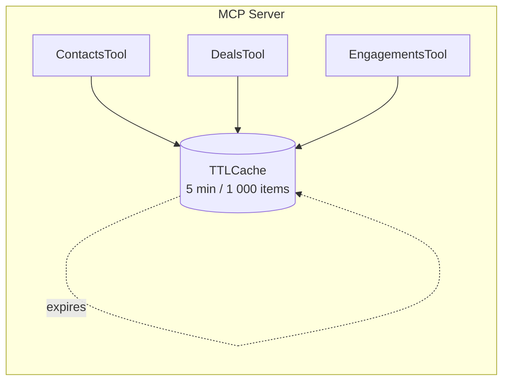

# HubSpot MCP Cache System

## Overview

The HubSpot MCP server uses an **in-memory shared TTL (Time-to-Live) cache** to drastically reduce the number of outbound requests to HubSpot's public API.  Every read-only tool (contacts, companies, deals, properties, engagements, …) automatically stores its result in this cache so that subsequent identical calls can be served instantly.

* **Backend**: [`cachetools.TTLCache`](https://cachetools.readthedocs.io/)
* **Default TTL**: `300 seconds` (5 minutes)
* **Maximum entries**: `1 000`

A single cache instance is shared between every tool **inside the same Python process**.  The cache key includes a hash of the API key, guaranteeing that data originating from different HubSpot accounts never collide.



---

## Managing the Cache at Runtime

The server exposes a dedicated MCP tool named `manage_hubspot_cache` that lets you inspect or flush the cache without restarting the process.

### Tool Definition (excerpt)

```json
{
  "name": "manage_hubspot_cache",
  "description": "Manage the HubSpot cache system (view stats, clear cache)",
  "parameters": {
    "action": {
      "type": "string",
      "enum": ["info", "clear"],
      "default": "info"
    }
  }
}
```

### Usage Examples

1. **Show cache statistics**

   ```jsonc
   {
     "name": "manage_hubspot_cache",
     "arguments": {"action": "info"}
   }
   ```

   Typical response (formatted by the tool):

   ```text
   🗄️ HubSpot Cache Information

   📊 Statistics:
     • Current size: 42 entries
     • Maximum size: 1000 entries
     • Time to live (TTL): 300 seconds
     • Cache utilization: 4.2%

   🔑 Sample Cache Keys (showing first 10):
     1. 71689b3ed3da9f31...
     2. 9f1eb328a943b2ff...
     ...
   ```

2. **Clear the cache**

   ```jsonc
   {
     "name": "manage_hubspot_cache",
     "arguments": {"action": "clear"}
   }
   ```

   Response:

   ```text
   ✅ Cache Cleared Successfully

   The HubSpot cache has been cleared. All subsequent requests will fetch fresh data from the API.
   ```

> **Tip**: After clearing the cache, the first request for each resource will hit the HubSpot API again and therefore be slightly slower.

---

## Configuration & Customisation

The cache parameters are defined in `src/hubspot_mcp/tools/base.py`:

```python
_cache: TTLCache = TTLCache(maxsize=1000, ttl=300)
```

If you need different values (e.g. longer TTL or larger capacity) you can:

1. **Fork the project** and modify the constants directly; **or**
2. **Subclass** `BaseTool` in your own extensions and override the `_cache` class attribute.

At the moment there is **no environment variable** to tweak the TTL or size, because the defaults work well for most use-cases and keep the public API request quota low.

---

## Frequently Asked Questions

| Question | Answer |
|----------|--------|
| *Does the cache survive a process restart ?* | No. The cache lives in memory; restarting the MCP server starts with an empty cache. |
| *Will concurrent Docker replicas share the cache ?* | No. Each replica maintains its own in-memory cache. If you need a distributed cache, consider adding Redis and replacing the TTLCache with a networked backend. |
| *Can cached entries expire earlier than 5 minutes ?* | Yes. The least-recently-used (LRU) eviction strategy of `cachetools` may drop entries sooner if the 1 000-item limit is reached. |

---

## Internal Implementation Details

* Each tool calls `BaseTool._cached_client_call()` instead of the client method directly.
* A SHA-256 hash of the **method name**, **sorted arguments** and **API key** is used as the cache key.
* Cache hits and misses are logged at `DEBUG` level with the first eight characters of the key, never the full key nor sensitive data.

For the full implementation see [`src/hubspot_mcp/tools/base.py`](../src/hubspot_mcp/tools/base.py).
